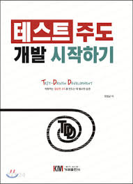

# 테스트 주도 개발 시작하기
### 최번균 저

#### 1. TDD 개발 준비
#### 2. TDD 시작
#### 3. 테스트 코드 작성 순서
#### 4. TDD 기능 명세 설계
#### 5. Junit 5 기초
#### 6. 테스트 코드의 구성
#### 7. 대역
#### 8. 테스트 가능한 설계
#### 9. 테스트 범위와 종류
#### 10. 테스트 코드와 유지보수
#### 11. 마치며
