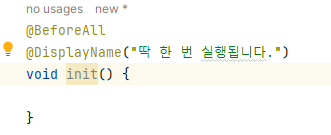
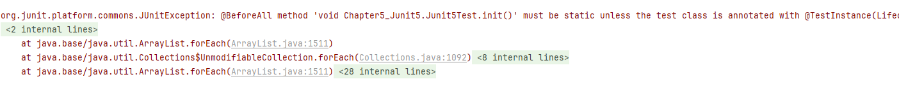
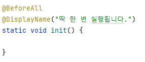
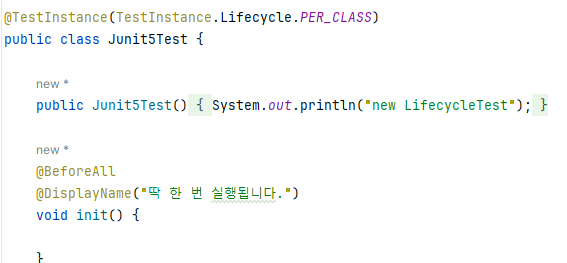

## 정리

### Junit5 구성
- Junit 플랫폼: 테스팅 프레임워크를 구동하기 위한 런처와 테스트 엔진을 위한 API를 제공
- Junit 주피터: Junit5를 위한 테스트 API와 실행 엔진을 제공
- Junit 빈티지: Junit3, 4로 작성된 테스트를 Junit5 플랫폼에서 실행하기 위한 모듈을 제공

#### Junit 플랫폼
- Junit5 테스트를 실행하기 위한 런타임 환경을 제공한다.
- 빌드 도구 및 IDE와 쉽게 통합할 수 있도록 API, 매커니즘 제공

#### Junit 주피터
- Junit5 어노테이션들을 제공해준다.
- @Test, @BeforeEach, @AfterEach, Assertions...etc

#### Junit 빈티지
- Junit3, 4를 Junit5에서 사용할 수 있도록 모듈을 제공해준다.
- TestEngine 인터페이스를 제공하며, 기존 테스트 프레임워크를 지원한다.
- 주의사항: 새로운 기능과 레거시 테스트 간의 충돌이나 예상치 못한 동작이 발생할 수는 있다.

#### 어노테이션
- @Test: 테스트를 진행할 메서드에 붙인다.
- @BeforeEach
- @AfterEach
- @BeforeAll
  - 초기화 작업을 수행하는 데 주로 사용한다.
  - 정적 메세드를 붙인다.

 
- @AfterAll

##### BeforeAll을 정적 메서드를 붙여야 하는 이유
- @BeforeAll은 테스트 클래스의 모든 테스트가 실행 되기 전에 딱 한 번 실행
- 비정적 메서드는 객체가 생성된 후에 함수를 호출
- 정적 메서드는 객체가 생성되지 않을 때에도 호출
- 정적으로 선언하지 않을 경우 객체가 없어서 오류 발생

**오류**

**해결책**

1. static 추가

    

2. @TestInstance(Lifecycle.PER_CLASS) 추가

    
   `@TestInstance(TestInstance.Lifecycle.PER_CLASS)`로 설정 하면 테스트 클래스 전체에 걸쳐 단일 인스턴스가 사용됩니다.

 

##### @TestInstance
인스턴스 수명을 제어하는 데 사용한다.
1. PER_METHOD 
   - 기본 설정으로 @TestInstance를 지정하지 않으면 이 방식이 사용
   - 테스트 메서드 실행될 때마다 테스트 클래스의 새로운 인스턴스 발생
2. PER_CLASS
    - 클래스 전체에 대해 단일 인스턴스 생성
    - @BeforeAll, @AfterAll 메서드를 정적으로 선언할 필요 없음